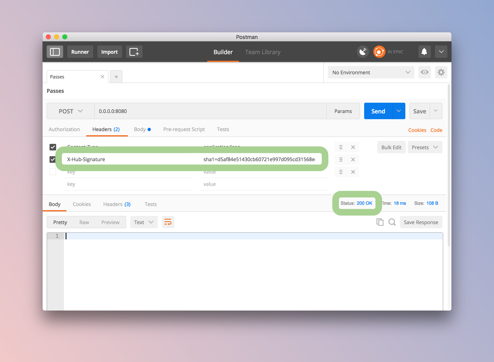
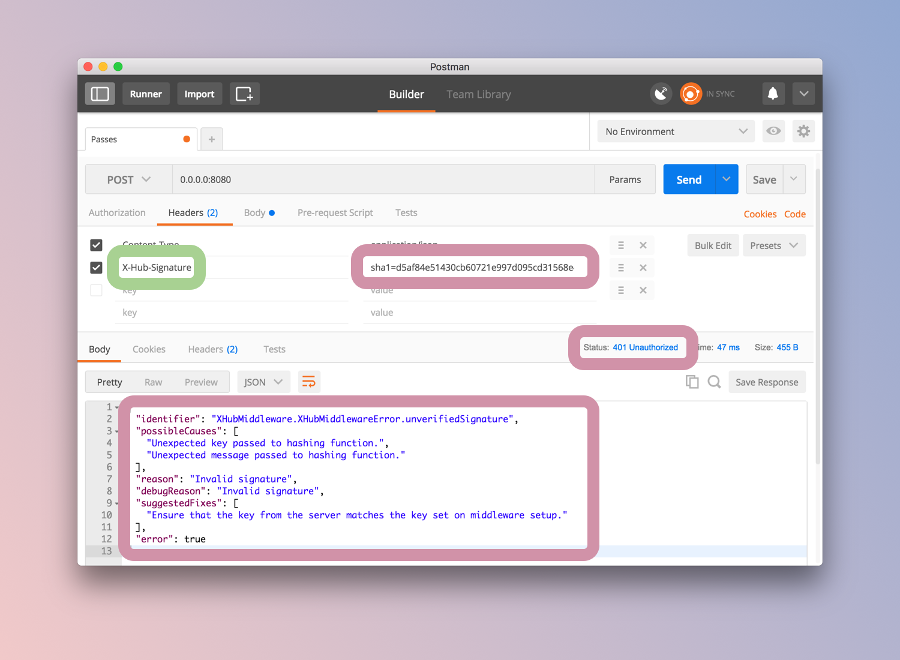
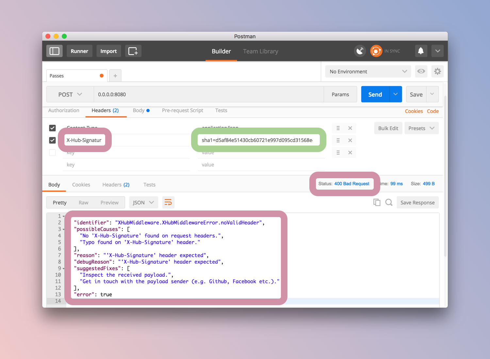

<h1 align="center">
	
	<br>
	<br>
</h1>

<br>
<br>

<p align="center">
	🔑 X-Hub-Signature Vapor middleware 🔑
<br>
<br>

<a href="https://swift.org">
    
</a>

<a>
    
</a>

<a>
    
</a>

<a href="http://vapor.codes">
    
</a>

<a href="https://travis-ci.org/ythecombinator/vapor-x-hub-middleware">
    
</a>

<a href="https://codebeat.co/projects/github-com-ythecombinator-vapor-x-hub-middleware-master">
    
</a>

<a href="LICENSE.md">
    
</a>

</p>
<br>

---

## 📚 Table of Contents

<!-- DO NOT EDIT THE COMMENTS BELOW -->

<!-- toc -->

- [Installation](#-installation)
- [Getting Started](#-getting-started)
- [Now It Works](#-now-it-works)
- [How It Works](#-how-it-works)
- [License](#-license)

<!-- tocstop -->

## 📦 Installation

You just need to add this package as a dependency in your `Package.swift`:

```swift
let package = Package(
    name: "MyProject",
    dependencies: [
        .Package(url: "https://github.com/ythecombinator/vapor-x-hub-middleware.git", majorVersion: 1),
        // ...
    ]
    // ...
)
```

## 🚀 Getting Started

First of all, add the `x-hub-signature` middleware into your droplet middlewares array (inside `Config/droplet.json`):

```json
{
    ...
    "middleware": [
        "error",
        "x-hub-signature",
        ...
    ],
    ...
}
```

> *Note*: Make sure you insert this middleware after the `error` one. Otherwise the proper headers and body might not be added to the response.

Next time you boot your application, you will be prompted to add a `x-hub-signature.json` file inside `Config/secrets` which is like:

```json
{
    "secret": "my_key",
}
```

> *Note*: Environment Variables might not be the safest solution for secret data–there's [much stuff](https://diogomonica.com/2017/03/27/why-you-shouldnt-use-env-variables-for-secret-data/) [out there](https://support.cloud.engineyard.com/hc/en-us/articles/205407508-Environment-Variables-and-Why-You-Shouldn-t-Use-Them) on this. However, following the [twelve-factor app manifesto](https://12factor.net/config) can be a wiser instead of storing this data on a simple `.json`, so you'd better do something like:

```sh
export MY_KEY=my_key
```

and then:

```json
{
    "secret": "$MY_KEY"
}
```

Afterwards you can add the middleware using a throwing overload of the initialiser that accepts Vapor's `Config`:

```swift
import XHubMiddleware

let config = try Config()
try config.setup()

// ↓ ↓ ↓ important setup stuff ↓ ↓ ↓

do {
    try config.addConfigurable(middleware: XHubMiddleware(config: config), name: "x-hub-signature")
} catch {
    fatalError("Error creating XHubMiddleware, please check that you've setup x-hub-signature.json correctly.")
}

// ↑ ↑ ↑ important setup stuff ↑ ↑ ↑

let drop = try Droplet(config)
try drop.setup()
try drop.run()
// ...
```

## 🎇 Now It Works

A working scenario would be:

*Your secret*: `secret`

*The payload received from the server*:

```json
{
    "example": "payload"
}
```

When everything goes okay, this middleware doesn't take care of forming the
response body –it just returns a `200` *HTTP status*–since the feedback
given by the webhook to pushed events may vary depending on your domain.

<p align="center"> 
    
</p>

Now let's say that the event emitter sent a different `X-Hub-Signature` than the expected:

<p align="center"> 
    
</p>

Last but not least, we are also aware of malformed–without a valid `X-Hub-Signature`
header–requests:

<p align="center"> 
    
</p>

> *Yay*, for [sugary error messages](http://robotlolita.me/2016/01/09/no-i-dont-want-to-configure-your-app.html).

## 🤓 How It Works

The client must generate an `HMAC` signature of the payload and include that signature in the request headers. The `X-Hub-Signature` header's value must be `sha1=signature`, where signature is a hexadecimal representation of a `SHA1` signature. The signature must be computed using the `HMAC` algorithm with the request body as the data and the secret as the key.

This middleware recomputes the `SHA1` signature with the shared secret using the same method as the client. If the signature does not match, the request cannot be verified and should probably be dropped.

> Originally this technique has been described in the [PubSubHubbub](https://pubsubhubbub.github.io/PubSubHubbub/pubsubhubbub-core-0.4.html#authednotify) spec.

## ⚖️ License

[X-Hub-Signature Vapor middleware](https://github.com/ythecombinator/vapor-x-hub-middleware) is distributed under
the MIT License, available in this repository.

All contributions are assumed to be also licensed under the same.
